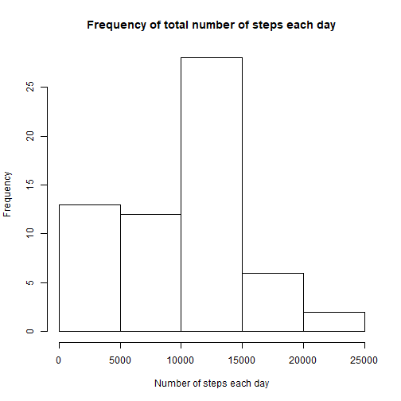
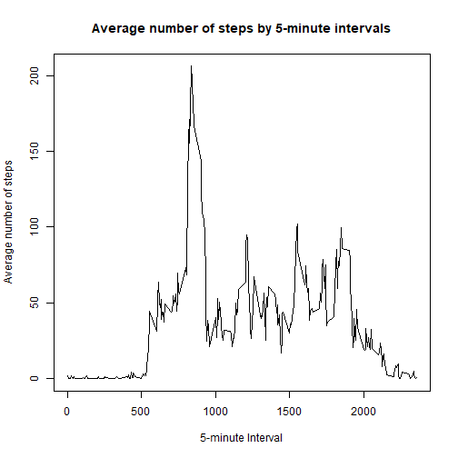
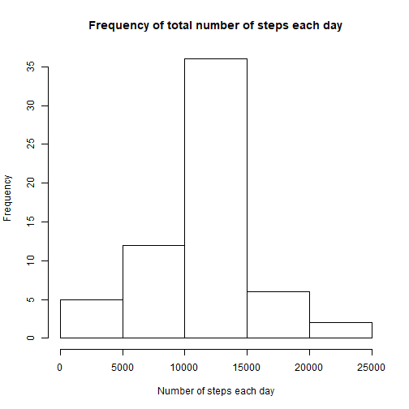
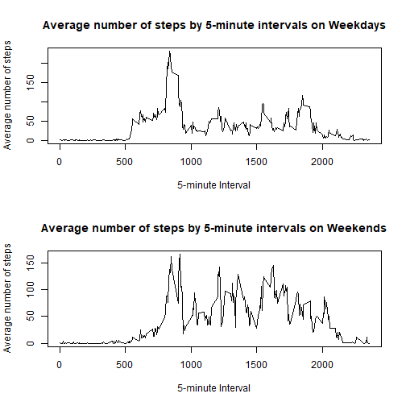

Week2 Project Assignment
============================================

##Loading and preprocessing of the data


```r
FileURL = "https://d396qusza40orc.cloudfront.net/repdata%2Fdata%2Factivity.zip"
FileName = "ActivityMonitoringData"
if (!file.exists(FileName)==TRUE) {
    download.file(url = FileURL, destfile = FileName, method = "curl")
}
if (!file.exists("activity.csv")==TRUE) {
    unzip(FileName)
}
data <- read.csv("activity.csv")
head(data)
```

```
##   steps       date interval
## 1    NA 2012-10-01        0
## 2    NA 2012-10-01        5
## 3    NA 2012-10-01       10
## 4    NA 2012-10-01       15
## 5    NA 2012-10-01       20
## 6    NA 2012-10-01       25
```

##What is the mean total number of steps taken per day?


```r
library(dplyr)
```

```
## 
## Attaching package: 'dplyr'
```

```
## The following objects are masked from 'package:stats':
## 
##     filter, lag
```

```
## The following objects are masked from 'package:base':
## 
##     intersect, setdiff, setequal, union
```


```r
data_by_date <- group_by(data, date)
dataTotal <- summarize(data_by_date, Total = sum(steps, na.rm = TRUE))
hist(x = dataTotal$Total, xlab = "Number of steps each day", main = "Frequency of total number of steps each day")
```



```r
data.frame(Mean = mean(dataTotal$Total), Median = median(dataTotal$Total))
```

```
##      Mean Median
## 1 9354.23  10395
```

##What is the average daily activity pattern?


```r
data_by_interval <- group_by(data, interval)
dataIntSteps <- summarize(data_by_interval, meanIntSteps = mean(steps, na.rm = TRUE))
dataIntSteps$interval <- as.character(dataIntSteps$interval)
with(dataIntSteps, plot(x = interval, y = meanIntSteps, type = "l", xlab = "5-minute Interval", ylab = "Average number of steps", main = "Average number of steps by 5-minute intervals"))
```


The 5-minute interval that has the most number of steps is: 

```r
max <- which.max(dataIntSteps$meanIntSteps)
dataIntSteps[max,1] 
```

```
## # A tibble: 1 x 1
##   interval
##   <chr>   
## 1 835
```

##Imputing missing values

First, calculate and report the total number of missing values in the dataset

```r
NAcount <- is.na(data$steps)
sum(NAcount)
```

```
## [1] 2304
```

Second, fill in all the NA's with the average of the 5-min interval.

```r
NASeq <- dimnames(data[is.na(data$steps),])[1]
NASeq <- as.integer(unlist(NASeq))
dataNoNA <- data[-NASeq,]
dataYesNA <- data[NASeq,]
NAInterval <- data[is.na(data$step),3]
NAMeanSteps <- dataIntSteps[match(NAInterval, dataIntSteps$interval),2]
NAMeanSteps <- as.numeric(unlist(NAMeanSteps))
dataYesNA$steps <- NAMeanSteps
```

Then, create a new data set that contain 

```r
dataClean <- rbind(dataYesNA,dataNoNA)
dataClean <- arrange(dataClean, date)
```

Finally, Make a histogram of the total number of steps taken each day 
and 
Calculate and report the mean and median total number of steps taken per day. Do these values differ from the estimates from the first part of the assignment? What is the impact of imputing missing data on the estimates of the total daily number of steps?


```r
dataClean_by_date <- group_by(dataClean, date)
dataCleanTotal <- summarize(dataClean_by_date, Total = sum(steps, na.rm = TRUE))
hist(x = dataCleanTotal$Total, xlab = "Number of steps each day", main = "Frequency of total number of steps each day")
```



```r
data.frame(Mean = mean(dataCleanTotal$Total), Median = median(dataCleanTotal$Total))
```

```
##       Mean   Median
## 1 10766.19 10766.19
```
The answer is yes. These new data calculated using filled average steps give different estimates from the first part of the assianment. The mean is affected more by the data fill-in. This could be due to the fact that NA data were disregarded in the first analysis, while values are added in the second analysis, pulling higher the overall mean number of steps. 

##Are there differences in activity patterns between weekdays and weekends?

Note, For this part the \color{red}{\verb|weekdays()|}weekdays() function may be of some help here. Use the dataset with the filled-in missing values for this part.

1. Create a new factor variable in the dataset with two levels - "weekday" and "weekend" indicating whether a given date is a weekday or weekend day.

```r
dataClean$date <- as.Date(dataClean$date)
dataClean <- mutate(dataClean, days = weekdays(date))
days <- unique(dataClean$days)
dataWeekdays <- dataClean[dataClean$days %in% days[1:5],]
dataWeekends <- dataClean[dataClean$days %in% days[6:7],]
dataWeekdays <- mutate(dataWeekdays, categories = "weekdays")
dataWeekends <- mutate(dataWeekends, categories = "weekends")
dataCleanMutate <- rbind(dataWeekdays, dataWeekends)
```

2. Then, make a panel plot containing a time series plot (i.e. \color{red}{\verb|type = "l"|}type="l") of the 5-minute interval (x-axis) and the average number of steps taken, averaged across all weekday days or weekend days (y-axis). See the README file in the GitHub repository to see an example of what this plot should look like using simulated data.

```r
par(mfrow = c(2,1))
dataWeekdays_by_interval <- group_by(dataWeekdays, interval)
dataWeekdaysIntSteps <- summarize(dataWeekdays_by_interval, meanIntSteps = mean(steps, na.rm = TRUE))
dataWeekdaysIntSteps$interval <- as.character(dataWeekdaysIntSteps$interval)
with(dataWeekdaysIntSteps, plot(x = interval, y = meanIntSteps, type = "l", xlab = "5-minute Interval", ylab = "Average number of steps", main = "Average number of steps by 5-minute intervals on Weekdays"))
dataWeekends_by_interval <- group_by(dataWeekends, interval)
dataWeekendsIntSteps <- summarize(dataWeekends_by_interval, meanIntSteps = mean(steps, na.rm = TRUE))
dataWeekendsIntSteps$interval <- as.character(dataWeekendsIntSteps$interval)
with(dataWeekendsIntSteps, plot(x = interval, y = meanIntSteps, type = "l", xlab = "5-minute Interval", ylab = "Average number of steps", main = "Average number of steps by 5-minute intervals on Weekends"))
```


